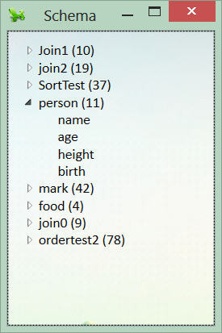

Designing and Querying a Simple Relational Database
=========

**Abstract**

Created a basic simulation of a relational database utilizing XML as the data storage scheme.  Possessed ability to create and drop tables, insert and query records including selection, joining, filtering, sorting, aggregation, and deletion, and bulk importing of arbitrary XML data.  

**Conclusion**

The application in its entirety consists of two parts—both an expressive relational querying language that manages an underlying database storing its data entirely  in xml data, and secondly, a means to harvest additional data from an arbitrary xml file in populating a relational database that can then be fully queried.  The querying language not only is able to create and delete tables or even simply statically view the tables, but it can query the resulting table in a wide plethora of manners, including giving the user an ability to join across any number of tables, sort the data such that the resulting data is understood in a more logical fashion, filter results based on a complex set of criteria, group the data using any number of aggregate functions, store temporary data to further query upon, and include aliases to allow users to rename columns.  Being able to query in such an expressive sense allows users to not only just observe static data but pick apart the data and learn far more than was previously possible.  Alas, this is what a true relational database attempts to do, and we feel that our application has in a small way emulated the workings of a real world relational database.  Surprisingly, the various limitations inherent in our querying language can be worked around and it can be found that the querying language is more expressive than previously thought.  For instance, we only allow the user to, in the where keyword, to use and’s or or’s, but no parenthesis.  This enforces a disjunctive normal form yet any set of expressions can be reduced to this form.  Similarly, another limitation is that one is not able to join tables to themselves even when a table is renamed.  This can be worked around by the user utilizing the set keyword in temporarily storing the exact same table as another name in the database in memory, then joining the original table to this temporary table.  

Lastly, we attempted to give users the ability, rather than laboriously inputting row by row into newly created tables, to import data from any arbitrarily structure xml file.  It was found that while this process was not as fully expressive and able to query xml data as say a true xml querying language might be, it serves its purpose quite well in query basic xml files and importing large sums of data into our database.   

**Tutorials**

- [Introduction](Documents/Help/Introduction.docx)
- [Syntax](Documents/Help/Syntax.docx)
- [User Interface](Documents/Help/User Interface.docx)

**Files**

- [Final Paper](Documents/Final Paper.docx)
- [Project Proposal](Documents/Project Proposal.docx)
- [Presentation Outline](Documents/Presentation Outline.docx)
- [Release](release.7z)

**Screenshots**

**Query Result** 

**Schema** 

**Create/Insert** 

**Filtering** 

**Sorting** 

**Joining** 

**Aggregation** 

**Deletion** 

**Bulk Import** 

**Log** 

